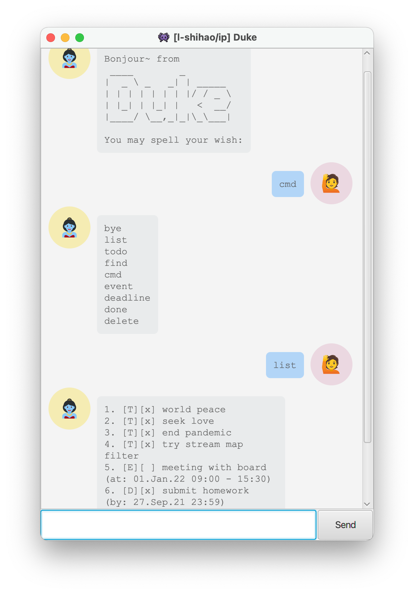

[](https://github.com/l-shihao/ip/actions/workflows/gradle.yml)
# 2022 Feb Update
Latest _Duke Chatbot_ **GUI** support:



Just double click the download `duke.jar` file from the [release](https://github.com/l-shihao/ip/releases/tag/v0.5.0) to run the application.

----
# Run the program 

## Get jar file
To run the program in terminal, download the `ip.jar` under [release](https://github.com/l-shihao/ip/releases/tag/A-Release) page then run: 
```
% java -jar ip.jar 
```
to start the program. 


## Run text-ui-test
To use the `text-ui-test`, `cd` to `text-ui-test` directory and run: 
```
% bash runtest.sh
```

----
# duke.Duke project template

This is a project template for a greenfield Java project. It's named after the Java mascot _Duke_. Given below are instructions on how to use it.

## Setting up in Intellij

Prerequisites: JDK 11, update Intellij to the most recent version.

1. Open Intellij (if you are not in the welcome screen, click `File` > `Close Project` to close the existing project first)
1. Open the project into Intellij as follows:
   1. Click `Open`.
   1. Select the project directory, and click `OK`.
   1. If there are any further prompts, accept the defaults.
1. Configure the project to use **JDK 11** (not other versions) as explained in [here](https://www.jetbrains.com/help/idea/sdk.html#set-up-jdk).<br>
   In the same dialog, set the **Project language level** field to the `SDK default` option.
3. After that, locate the `src/main/java/duke.Duke.java` file, right-click it, and choose `Run duke.Duke.main()` (if the code editor is showing compile errors, try restarting the IDE). If the setup is correct, you should see something like the below as the output:
   ```
   Hello from
    ____        _        
   |  _ \ _   _| | _____ 
   | | | | | | | |/ / _ \
   | |_| | |_| |   <  __/
   |____/ \__,_|_|\_\___|
   ```
