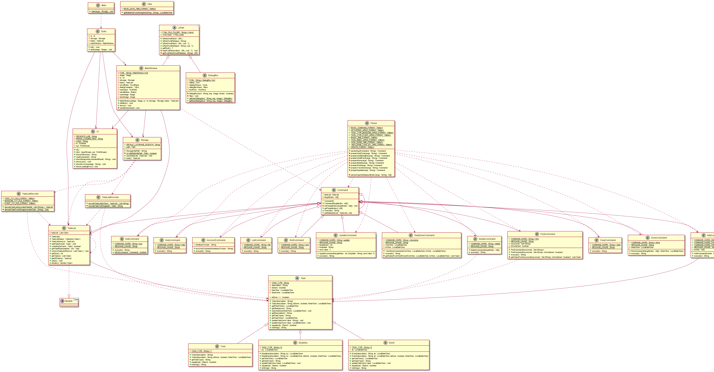
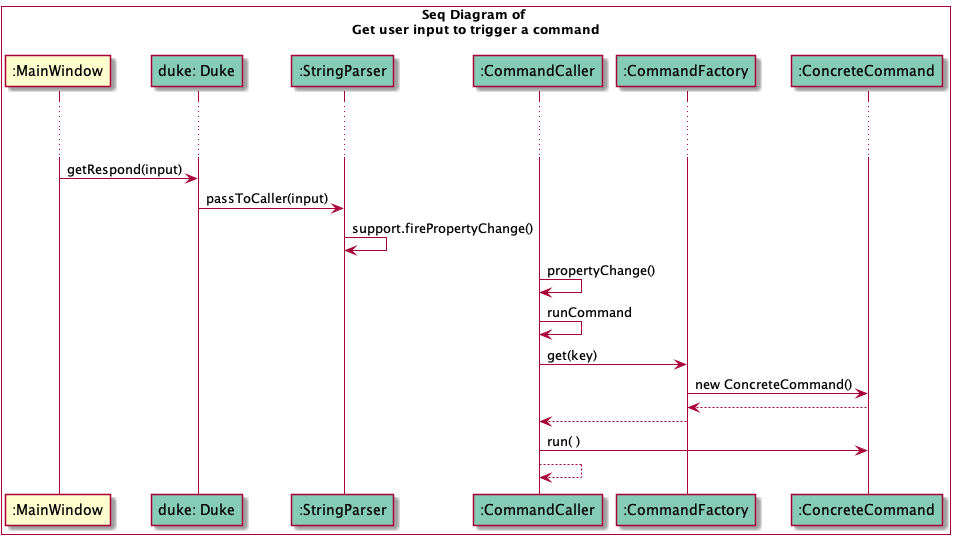

# Developer Guide 
Duke is a desktop app for managing your daily tasks with a beautiful chatbot _graphical user interface_ (GUI) and _command line interface_ (CLI) like command input.

## Acknowledgements
+ [SE_EDU JavaFx Tutorial](https://se-education.org/guides/tutorials/javaFx.html)

## Set up
For user to try out the result of application, can simply download the `ip.jar` file from the latest [release](https://github.com/l-shihao/ip/releases),
double click to run the application (JDK 11 is required).

For developers to contribute to the code:
```
git clone https://github.com/l-shihao/ip.git
```
## Design 
Class diagram as below: 

Seems there is a need to set up a dispatcher in the middle to decouple the parsing and message printing requests [plan for future version].

## Implementation 
For example, how the interface MainWindow takes from user input to initiate a concrete command:

Note that because `CommandCaller` subscribes to the `StringParser` as a Listener, once `StringParser` done its parsing and fired a PropertyChange event, 
Event Listener would get the changes and take action to run corresponding methods. Similar thing often occurs when changes happen and `Storage` automatically writes to data file.

## Testing 
Gradle and GiHub Action was setup to run CI test checks upon commit, refer to [Java CI records here](https://github.com/l-shihao/ip/actions/workflows/gradle.yml).

----

## Appendix 

### User Stories 

|As a | I want to | so that I can |
| - | - | - |
|productive user | delete multiple tasks in one command line  | save the time to key command many times |
|forgetful user | have a command that shows all the command keywords  | remember what features I could use |
|organised user | assign tasks tags  | group similar tasks together in a view |
|organised user|find all tasks with a tag| sort out only the tasks I care under one context|

### Requirements

+ User is able to add a task with multiple tags 
+ User is able to find all tasks under one tag 
+ User to have a chatbot like graphical interface
----
+ The response from Duke should not exceed 1s
+ Application should not crash due to user key in wrongly