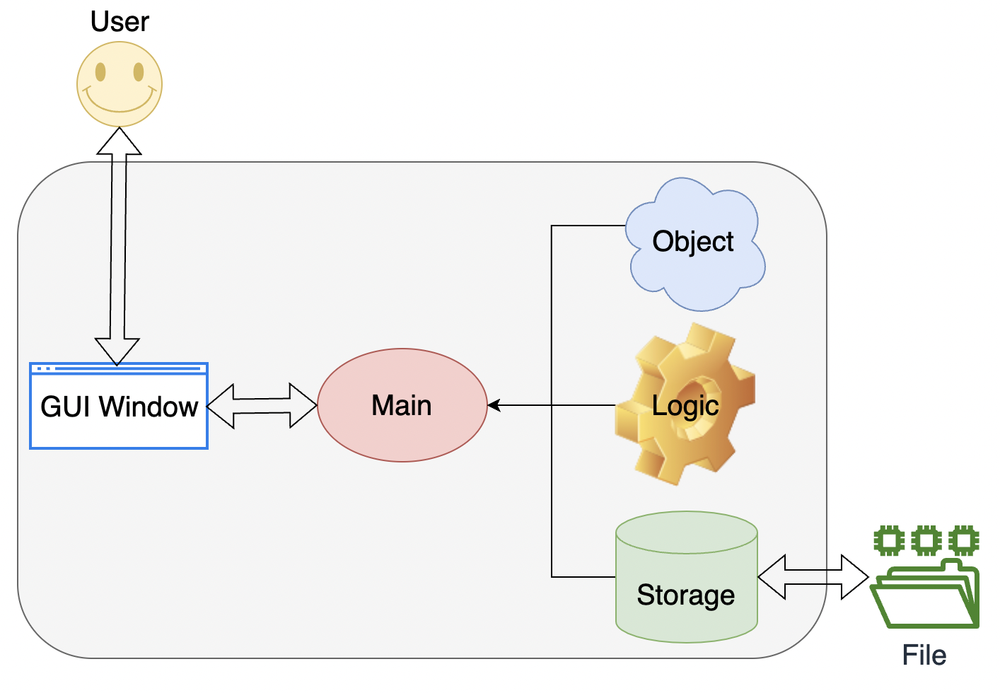
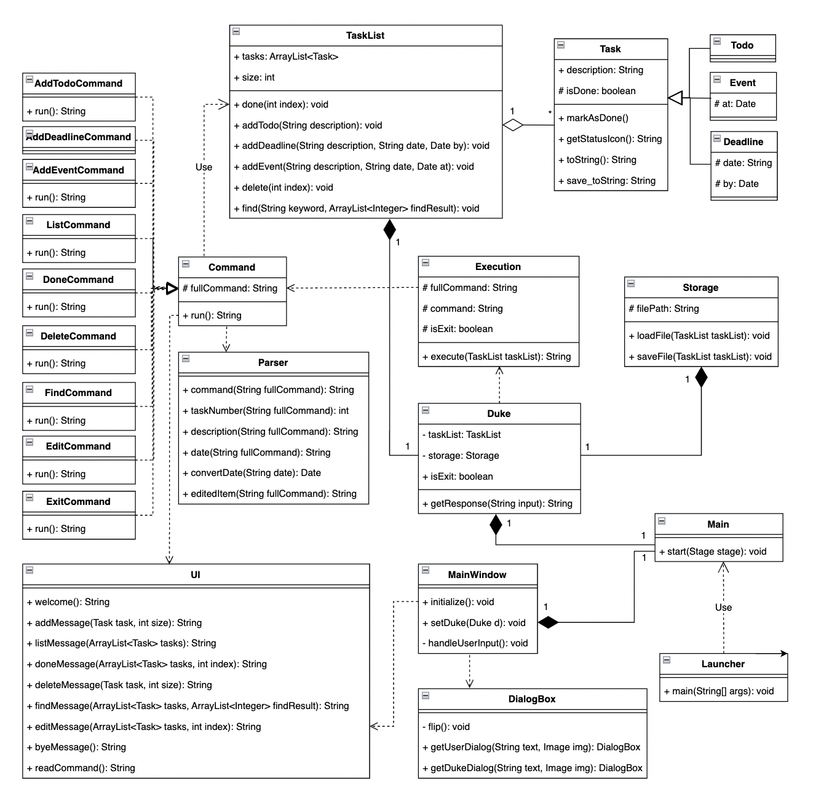
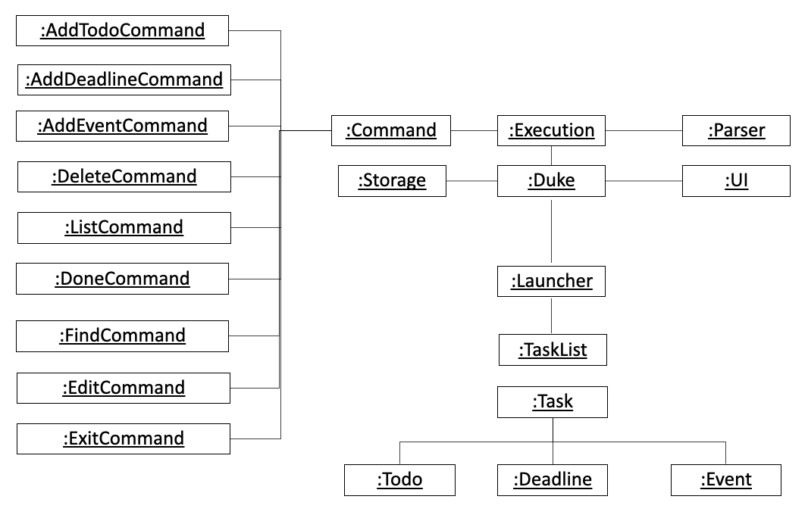
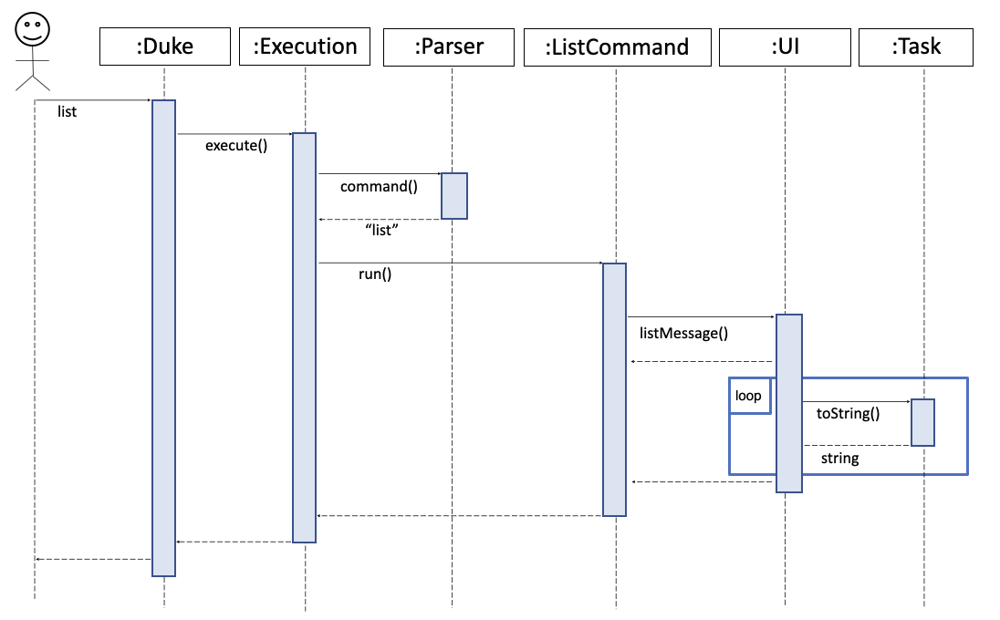
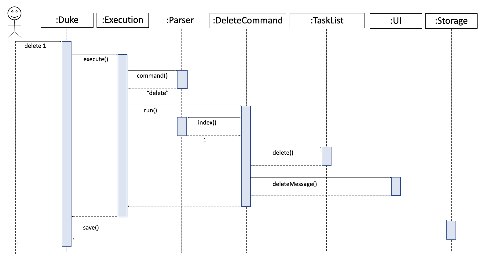
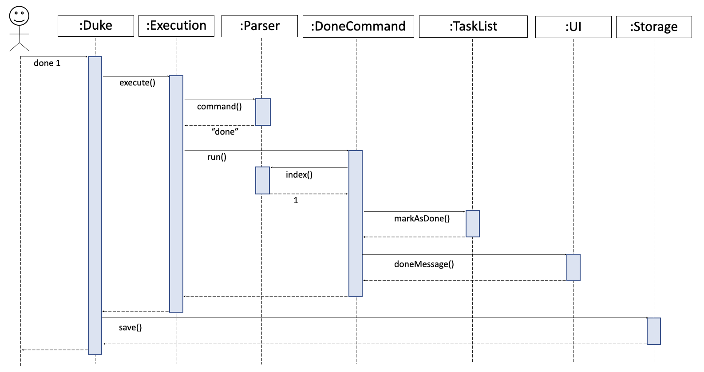
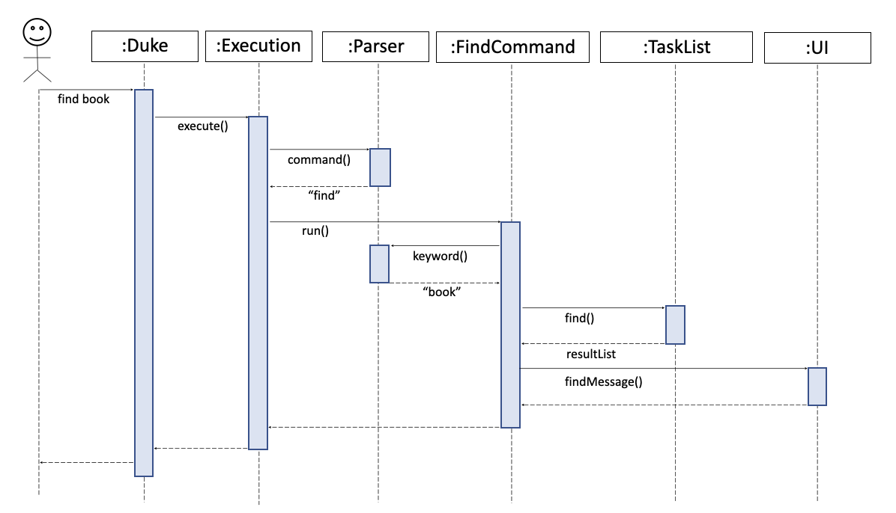
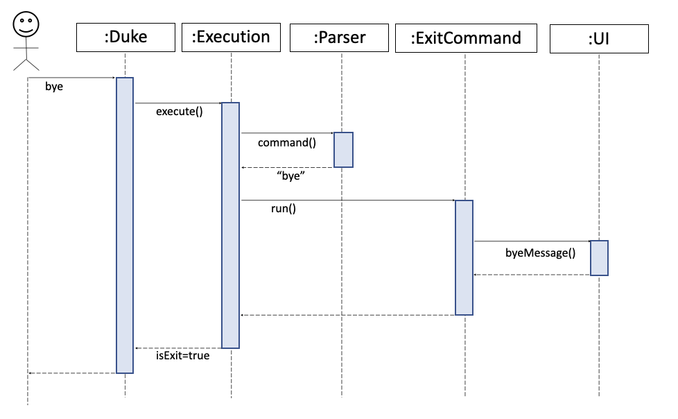

# Developer Guide

* *[Acknowledgements](DeveloperGuide.md#acknowledgements)*
* *[Setting up, getting started](DeveloperGuide.md#setting-up-getting-started)*
* *[Design](DeveloperGuide.md#design)*
* *[Implementation](DeveloperGuide.md#implementation-sequence-diagram)*
* *[Testing](DeveloperGuide.md#testing)*
* *[Appendix: Requirements](DeveloperGuide.md#appendix-requirements)*

## Acknowledgements

Thanks to Prof Damith C.Rajapakse and Boyd Anderson provide consultation for me.

## Setting up, getting started
**Refer to the guide** <a href="https://github.com/zyjarvis/ip">Setting up and getting started.</a>

## Design 

* *Architecture* <br/>
   <br/>
* *UI component* (UI, Input / Output, DialogBox, MainWindow, Main, Launcher)  
* *Logic component* (Duke, Execution, Command, Parser)
* *Model component* (Task, TaskList)
* *Storage component* (Storage)
   API: <a href="https://github.com/zyjarvis/ip/blob/master/src/main/java/duke/Storage.java">Storage.java</a>   
   <br> The Storage component,
   <br> a. can save duke.txt file to /data folder and load the duke.txt file back /data folder with corresponding format.
   <br> b. auto save when user execute done, edit, delete and add command    
   <br>    `File format` showing as below, 

            T | Y | borrow book
            D | N | return book | 20-11-2019
            E | N | party | 21-11-2019

* *Common classes* (TaskList)

* *Class diagram*
        
* *Object diagram*
        

## Implementation (Sequence Diagram)

* List Command
  <br> The user execute `list` command to show all the tasks in the list.
  <br> UI scanned `list` command from user, `Execution` create a new `ListCommand` and `run()` to get the tasks from list, taskList return the items to UI and show to user.



* Delete Command
  <br> The user execute `delete INDEX` command to delete the task in the task list.
  <br> The working flow of the deleteCommand is shown in the sequence diagram below.



* Done Command
  <br> The user execute `done INDEX` command to mark the completed task in the item list.
  <br> The working flow of the doneCommand is shown in the sequence diagram below.



* Find Command
  <br> The user execute `find KEYWORD` command to search tasks contain `KEYWORD` in the task list.
  <br> The working flow of the findCommand is shown in the sequence diagram below.



* Exit Command
  <br> The user execute `exit` command to quit the program.
  <br> The working flow of the exitCommand is shown in the sequence diagram below.



## Testing
* **Testing Guide** 
    <br> There are two ways to run tests:

    1. Using **IntelliJ JUnit test runner**. Run all tests, right-click on the `src/test/java` folder </br>
        a. choose `Run` 'All Tests' </br>
        b. Run a subset of tests, you can right-click on a test package, test class and select `Run` 'ParserTest' </br>
    2. Using **Gradle**
        Open a console and run the command gradlew clean test (Mac/Linux: ./gradlew clean test)

## Appendix: Requirements

### Product scope

**Target user profile**

* has a need to manage and track daily tasks
* prefers desktop apps over other types
* prefers typing to mouse interactions
* is reasonably comfortable using CLI apps

**Value proposition**

* keep information of all daily tasks
* track daily tasks easily
* record the date of tasks

### User Stories

| Version | As a ... | I want to ...                      | So that I can ...                               |
|---------|----------|------------------------------------|-------------------------------------------------|
| v1.0    |user| add task with description          | record all the tasks                            |
| v1.0    |user| view all the tasks                 | know the status of the tasks                    |
| v1.0    |user| delete the task                    | remove the task which is assigned to others     |
| v1.0    |user| have exit command                  | quit the system without using mouse             |
| v2.0    |user| mark completed tasks               | know which tasks are not completed yet          |
| v2.0    |user| add task with description and date | know when is the schedule of the task           |
| v2.0    |user| search tasks with keyword          | view the specific task quickly                  |
| v2.0    |user| save task list as file             | print record into hard copy                     |
| v2.0    |user| read previous tasks from the file  | continue to add task from the previous record   |
| v3.0    |user| have interact with system via GUI  | have more fun while using the system            |
| v3.0    |user| edit the item without deleting it  | rectify the task with wrong information quickly |

### Use Cases

(For all use cases below, the **System** is ```DukePro (Duke)``` and the **Actor** is the ```user```, unless specified otherwise)

**Use case: Add Todo**
1. User keys in todo task description
2. Duke records the todo task 
3. Duke shows the todo task added successfully 
4. Data file updated automatically

**Use case: Add Deadline**
1. User keys in deadline task description and date
2. Duke records the deadline task
3. Duke shows the deadline task added successfully
4. Data file updated automatically

**Use case: Add Event**
1. User keys in event task description and date
2. Duke records the event task
3. Duke shows the event task added successfully
4. Data file updated automatically

**Use case: List Items**
1. User requests to view tasks
2. Duke shows the list of tasks

**Use case: Delete Item**
1. User requests to delete a specific task
2. Duke deletes the task from the list
3. Duke shows the item deleted successfully
4. Data files updated automatically

**Use case: Done Item**
1. User requests to update a specific task when it is done
2. Duke marks the task as done
3. Duke shows the task updated successfully
4. Data files updated automatically

**Use case: Find Items**
1. User keys in the keyword to search
2. Duke performs searching
3. Duke displays the result

**Use case: Edit Item**
1. User requests to edit a specific task with new description
2. Duke updated the task in the list
3. Duke shows the task updated successfully
4. Data files updated automatically

**Use case: Exit**
1. User requests to exit the program
2. Duke terminates safely

### Non-Functional Requirements

* Should work on any mainstream OS as long as it has Java 11 or above installed.
* Should be able to hold up to 1000 tasks without a noticeable sluggishness in performance.
* The command should be simple enough so that users are able to accomplish most of the tasks faster using typing than using the mouse.
* Should be easy for new users to get used to usage.

### Glossary

**Mainstream OS**:  Windows, Linux, Unix, OS-X
