# Developer Guide

## Setting up, getting started
**Refer to the guide** <a href="https://github.com/nus-tic4002-AY2122S2/ip">
Setting up and getting started.</a>

## Design 

* *Architecture*
* *UI component* (JavaFx, Fxml)  
* *Logic component* (Execution, Command, Parser)
* *Model component* (Task, Todo, Deadline, Event)
* *Storage component* (Storage)
* *Common classes* (TaskList)

##### Class Diagram

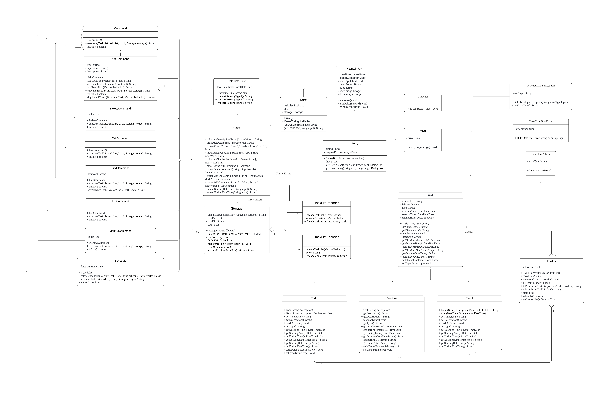

## Implementation (Sequence Diagram)

* Find Command
<br> The user execute `find KEYWORD` command to search tasks contain `KEYWORD` in the 
task list.
<br> The working flow of the findCommand is shown in the sequence diagram below.

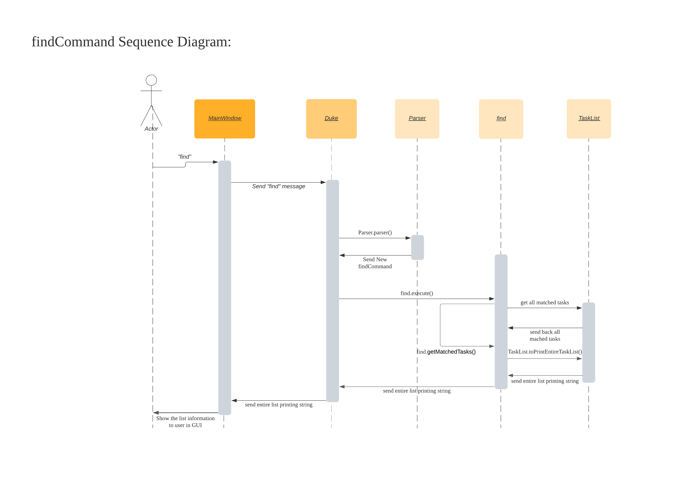

* List Command <br>
The user execute `list` command to show all the tasks in the list.<br/>
UI scanned `list` command from user, `Execution` create a new `ListCommand` 
and `run()` to get the tasks from Arraylist, taskList return the tasks to GUI 
and show to user. <br/>

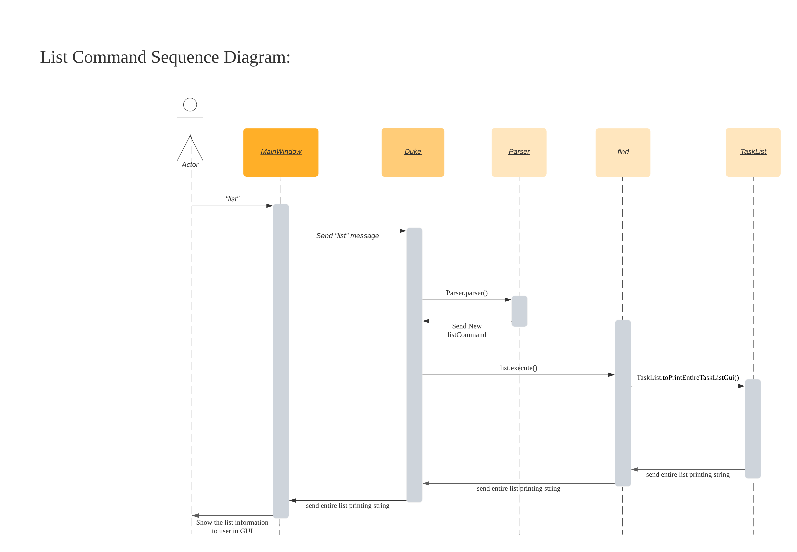

* Delete Command
<br> The user execute `delete 5` command to delete the 5th task in the task list.
<br> The `Execution` type variable will be generated after user input scanned 
and in execution variable, the `Delete` command will be created 
and `run()` method in `Delete` class will be executed to remove the 5th item. 
After the task be removed, the delete information will be printed to show user 
which the deleted task's details and remaining task quantity in the task list.

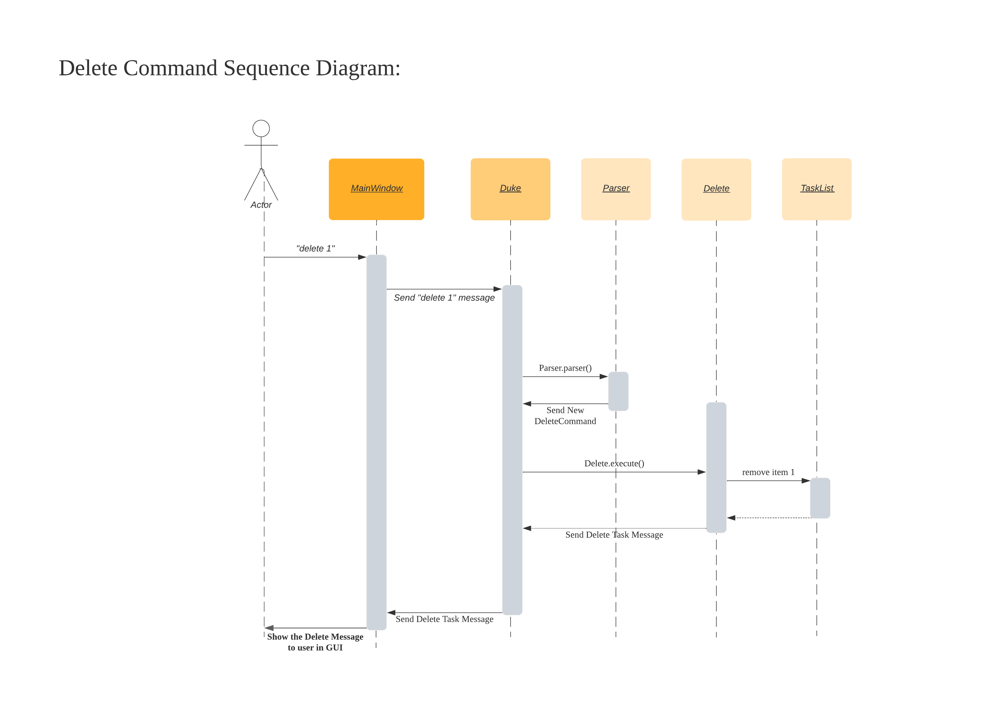

* Todo Command
<br> The user execute `todo take taxi` command to add the todo task which the
description is `take taxi` and which the task type is `todo` to the task list. 
<br> The `todo` type variable will be generated after user input scanned and
 in execution variable, the `addCommand` will be generated and `execute()` method 
 in `addCommand` will add the todo task to task list
 
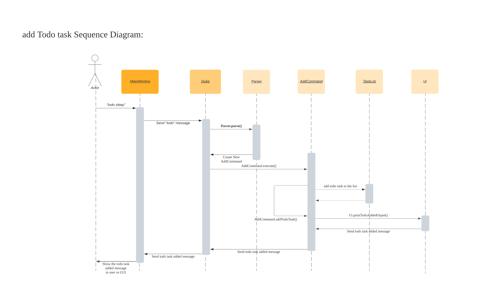

* Deadline Command
<br> The user execute `deadline sleep /by 2022-02-11 22:59` command to add the
deadline task which the description is `sleep` and the deadline is `2022-02-11 22:59`
The task type is `d` which standard for deadline. The `todo` type variable will 
be generated after user input scanned and in execution variable, the `addCommand` 
will be generated and `execute()` method in `addCommand` will add the deadline task 
to task list

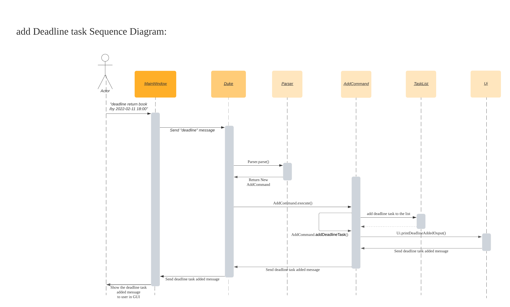

* Event Command
<br> The user execute `event party /at 2022-02-11 22:59 -> 2022-02-12 16:00` command to add the
deadline task which the description is `sleep` and the deadline is `2022-02-11 22:59`
The task type is `d` which standard for deadline. The `todo` type variable will 
be generated after user input scanned and in execution variable, the `addCommand` 
will be generated and `execute()` method in `addCommand` will add the deadline task 
to task list

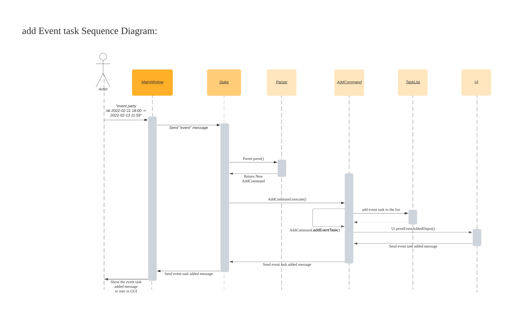


## Appendix: Requirements

### Product scope

**Target user profile**
* has a need to manage and track tasks
* prefers desktop apps over other types
* prefers typing to mouse interactions
* is reasonably comfortle using CLI apps and GUI apps

**Value proposition**
* keep record of task(s) (todo, deadline, and event task)
* find task(s) easily and clearly
* easy to remove task

### User Stories

|Version|As a ...|I want to ...| So that I can ...|
|--------|-------------|---------------|------------------|
|v1.0|user|add todo task with description |to record what should I do later|
|v1.0|user|view all the tasks|know all the outstanding task(s) and the task I have done|
|v1.0|user|delete the task|remove the task which has wrong information|
|v1.0|user|have exit command|quit the system without using mouse|
|v2.0|user|add deadline task with description deadline date time|know when I should finish the task|
|v2.0|user|add event task with description starting date time and ending date time|know the event operating date time|
|v2.0|user|search task(s) with keyword|view the specific task(s) quickly|
|v3.0|user|want to work with GUI instead of CLI| Work more comfortable with Duke
|v3.0|user|get summary report of my existing item|know my total income and expense|
|v3.0|user|find the task with keyword(partial match)|find task if I cannot remember description clearly|

### Use Cases

(For all use cases below, the **System** is ```Duke``` and the **Actor** is the ```user```, unless specified otherwise)

**Use case: Add Task**
1. User keys in task details
2. Duke records the task
3. Duke shows the task added successfully
4. Data files updated automatically

**Use case: List Tasks**
1. User requests to view tasks
2. Duke shows the list of tasks

**Use case: Delete Task**
1. User requests to delete a specific task
2. Duke deletes the task from the list
3. Duke shows the task deleted successfully
4. Data files updated automatically

**Use case: Find Tasks**
1. User keys in the keyword to search
2. Duke performs searching
3. Duke displays the result

### Non-Functional Requirements

* Should work on any mainstream OS as long as it has Java 11 or above installed.
* Should be able to hold up to 1000 persons without a noticeable sluggishness in performance.
* The command should be simple enough so that users are able to accomplish most of the tasks faster using typing than using the mouse.
* Should be easy for new users to get used to usage fast.

### Glossary

**Mainstream OS**:  Windows, Linux, Unix, OS-X

## Appendix:  Instructions for manual testing

### Instructions for manual testing

{Give instructions on how to do a manual product testing 
e.g., how to load sample data to be used for testing}


**Start of Testing without existing sample data**
1. Run the `duke.jar` by using `CMD`
2. Key in any command (list, todo, find...) 
3. `data` folder and `dukeTasks.txt` file will be generated automatically in the same filepath as `duke.jar`

**Start of Testing with existing sample data**
1. Copy all your task(s) to `rootpath/data/dukeTasks.txt` file

**Task(s) storage format in `dukeTasks.txt`**
<br> `STATUS`: `0` or `1`, `0` stand for not done yet and `1` stand for done
<br> `DESCRIPTION`: The description of the task
<br> `DEADLINE_DATETIME`: The deadline data time with format: YYYY-MM-DD MM:SS
<br> `STARTING_DATETIME`: The event starting date time with format: YYYY-MM-DD MM:SS
<br> `ENDING_DATETIME`: The event ending date time with format: YYYY-MM-DD MM:SS

* `todo` task format: `T | STATUS | DESCRIPTION`
* `deadline` task format: `D | STATUS | DESCRIPTION | DEADLINE_DATETIME`
* `event` task format:`E | STATUS | DESCRIPTION | STARTING_DATETIME | ENDING_DATETIME`

After finish above steps, we can continue testing with below commands to test all the features of the task. The test below starts without any existing task.

* `list`


* `todo take taxi`

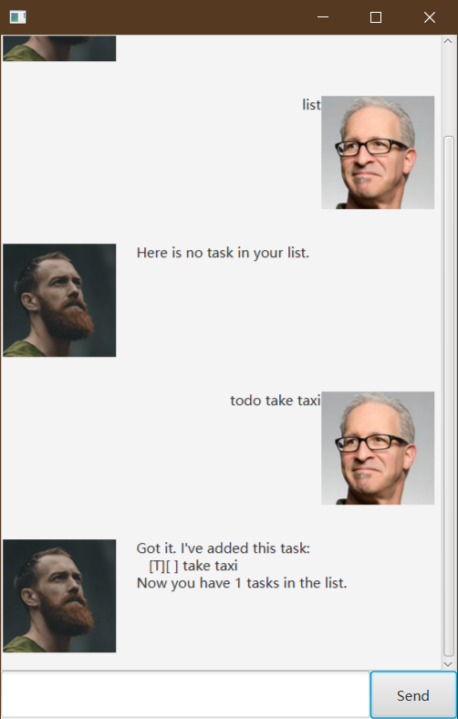

* `deadline return book /by 2022-02-22 17:59`

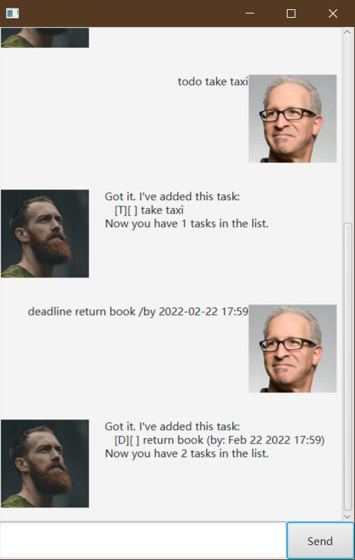

* `event Birthday Party /at 2022-03-28 18:00 -> 2022-03-28 23:00`


* `todo turn off light`

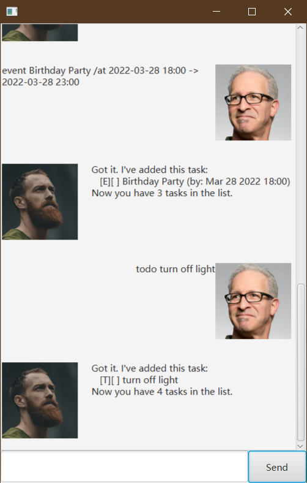

* `list`

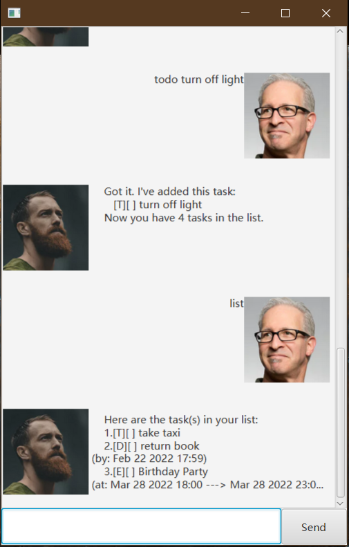

* `find book`


* `find tur` 


* `done 2`

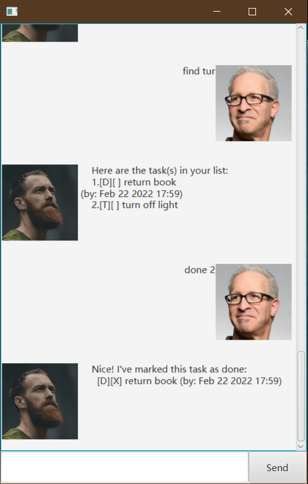

* `list`

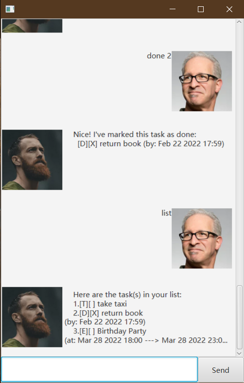

* `delete 3`

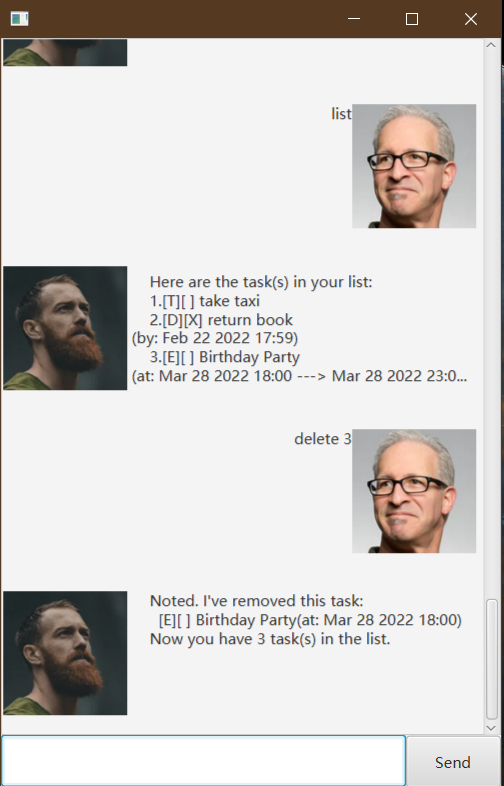

* `list`

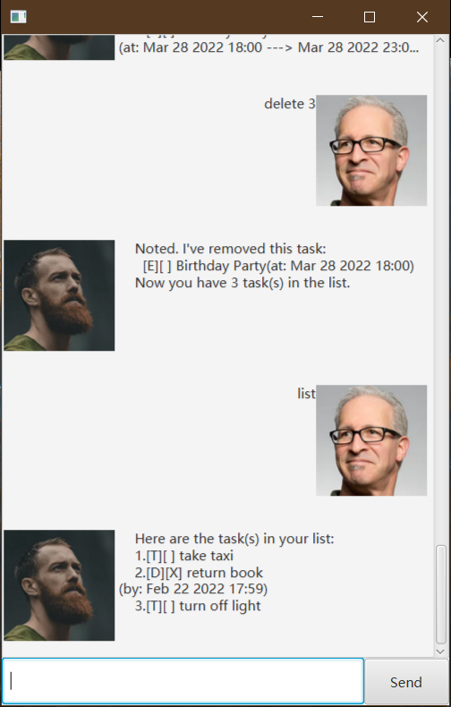


