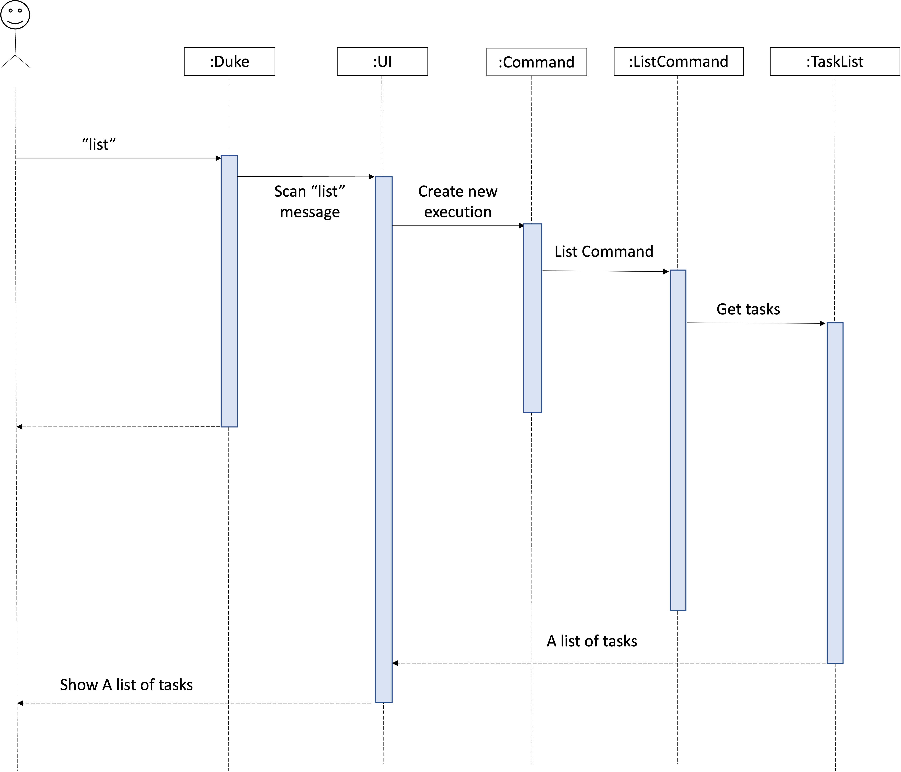

# Developer Guide

* *[Acknowledgements](DeveloperGuide.md#acknowledgements)*
* *[Setting up, getting started](DeveloperGuide.md#setting-up-getting-started)*
* *[Design](DeveloperGuide.md#design)*
* *[Implementation](DeveloperGuide.md#implementation-sequence-diagram)*
* *[Appendix: Requirements](DeveloperGuide.md#appendix-requirements)*


## Acknowledgements

* Thanks to Prof Damith C.Rajapakse and Boyd Anderson provide comprehensive material to guide my personal projects

## Setting up, getting started
**Refer to the guide** <a href="https://github.com/jr-mojito/ip/blob/master/docs/UserGuide.md">Setting up and getting started.</a>

## Design

* *Common classes* (TaskList)

1. ```Class diagram (refer to the image below)```<br/>
   
2. ```Object diagram```<br/>
   

## Implementation (Sequence Diagram)

* List Command <br>
  The user execute `list` command to show all the items in the list.<br/>
  UI scanned `list` command from user, `Command` create a new `ListCommand` and `run()` to get the tasks from Arraylist, taskList return the tasks to UI and show to user. <br/>

 <br/>

## Appendix: Requirements

### Product scope

**Target user profile**

* The Duke program implements an application that
  a personal Assistant Chatbot that helps to keep track various of daily items.

**Value proposition**

* keep record of tasks in the laptop
* track daily tasks effectively
* mark done when tasks is done.

### User Stories

| As a/an ...              | I want to ...                                                                   | So that I can ...|
|--------------------------|---------------------------------------------------------------------------------|------------------|
| user                     | list down all the tasks                                                         |overview whole pending todo item|
| user                     | add all pending task for daily task                                             |reduce the workload and handle schedule effectively|
| student                  | add the class schedule                                                          |manage to attend class on time|


### Non-Functional Requirements

* Should work on any mainstream OS as long as it has Java 11 or above installed.
* Should be able to hold up to 1000 tasks without a noticeable sluggishness in performance.
* The command should be simple enough so that users are able to accomplish most of the tasks faster using typing than using the mouse.

### Glossary

**Mainstream OS**:  Windows, Linux, Unix, OS-X