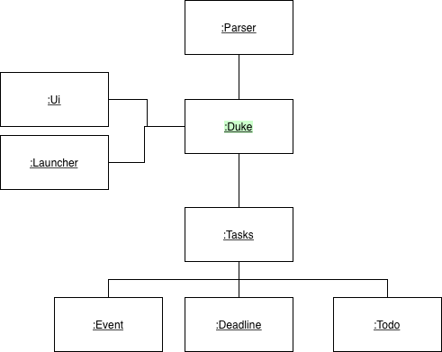

# Developer Guide

* *[Acknowledgements](DeveloperGuide.md#acknowledgements)*
* *[Setting up, getting started](DeveloperGuide.md#setting-up-getting-started)*
* *[Design](DeveloperGuide.md#design)*
* *[Implementation](DeveloperGuide.md#implementation-sequence-diagram)*
* *[Appendix: Requirements](DeveloperGuide.md#appendix-requirements)*


## Acknowledgements

* Thanks to Prof Damith C.Rajapakse and Boyd Anderson provide comprehensive material to guide my personal projects

## Setting up, getting started
**Refer to the guide** <a href="https://jr-mojito.github.io/ip/UserGuide.html">Setting up and getting started.</a>

## Design

1. ```Object diagram```<br/>
   


## Appendix: Requirements

### Product scope

**Target user profile**

* The Duke program implements an application that
  a personal Assistant Chatbot that helps to keep track various of daily items.

**Value proposition**

* keep record of tasks in the laptop
* track daily tasks effectively
* marked as done when task is done.

### User Stories

| As a/an ...              | I want to ...                                                                   | So that I can ...|
|--------------------------|---------------------------------------------------------------------------------|------------------|
| user                     | list down all the tasks                                                         |overview whole pending todo item|
| user                     | add all pending task for daily task                                             |reduce the workload and handle schedule effectively|
| student                  | add the class schedule                                                          |manage to attend class on time|


### Non-Functional Requirements

* Should work on any mainstream OS that Java 11 or above installed.
* Should be able to hold up to 1000 tasks.
* The application with GUI design are easier for user to interact with DUKE Chatbot that helps to keep track various of daily items.

### Glossary

**Mainstream OS**:  Windows, Linux, Unix, OS-X