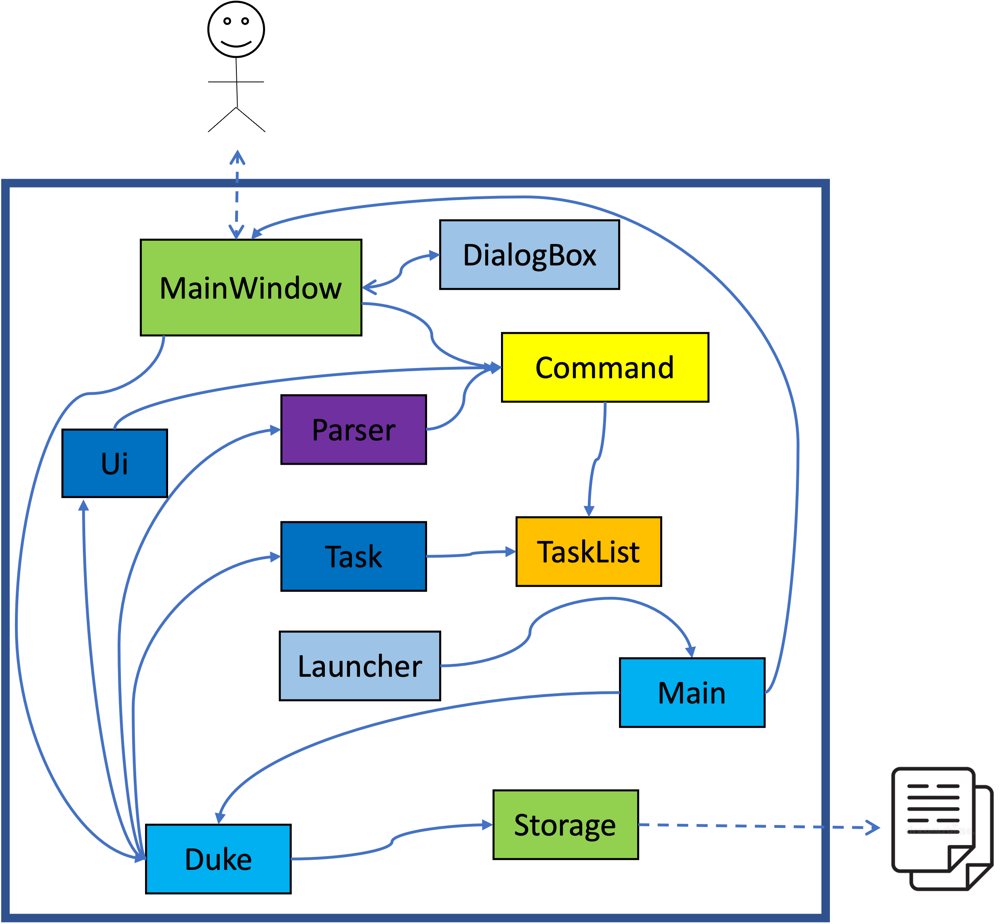

# Developer Guide

* *[Acknowledgements](DeveloperGuide.md#acknowledgements)*
* *[Setting up, getting started](DeveloperGuide.md#setting-up-getting-started)*
* *[Design](DeveloperGuide.md#design)*
* *[Implementation](DeveloperGuide.md#implementation-sequence-diagram)*
* *[Documentation, logging, testing](DeveloperGuide.md#documentation-logging-testing)*
* *[Appendix: Requirements](DeveloperGuide.md#appendix-requirements)*
* *[Use Cases](DeveloperGuide.md#use-cases)*

## Acknowledgements

* Thanks to Prof Damith C.Rajapakse and Boyd Anderson provide consulation for our tem.
* Thanks to the project team AY2122S1-TIC4001-F18-2.

## Setting up, getting started
**Refer to the guide** <a href="https://github.com/AY2122S1-TIC4001-F18-2/tp/blob/master/README.md">Setting up and getting started.</a>

## Design 

* *Architecture* <br/>
   <br/>
* *UI component* (CLI, Input/ Output)  
* *Logic component* (Execution, Command, Parser)
* *Model component* (Item, Expense, Income)
* *Storage component* 
   API: <a href="https://github.com/AY2122S1-TIC4001-F18-2/tp/blob/master/src/main/java/seedu/duke/Storage.java">Storage.java</a>   
   <br> The Storage component,
   <br> a. can save expenses.txt file to `/file` folder and load the expenses.txt file back `/file` folder with corresponding format.
   <br> b. auto save when user execute edit, delete and add expense/ income command    
   <br>    `File format` showing as below, 
   
            Here are the items in your list:
            1.[E] [Meal] lunch ($40.0) (2021-Dec-01) 
            2.[I] [OctSalary] salary ($4000.0) (2021-Dec-01) 

* *Common classes* (ItemList)

1. ```Class diagram (refer to the image below)```<br/>
        
2. ```Object diagram```<br/>
        

## Implementation (Sequence Diagram)

* Find Command
<br> The user execute `find KEYWORD` command to search items contain `KEYWORD` in the item list.
<br> The working flow of the findCommand is shown in the sequence diagram below.


* Exit Command
<br> The user execute `exit` command to quit the program.
<br> The working flow of the exitCommand is shown in the sequence diagram below.


* List Command <br>
The user execute `list` command to show all the items in the list.<br/>
UI scanned `list` command from user, `Execution` create a new `ListCommand` and `run()` to get the items from Arraylist, itemList return the items to UI and show to user. <br/>

 <br/>

* Delete Command
<br> The user execute `delete 5` command to delete the 5th item in the item list.
<br> The `Execution` type variable will be generated after user input scanned and in execution variable, 
the `Delete` command will be created and `run()` method in `Delete` class will be executed to remove the 5th item. After the item be removed, the delete information will be printed to show user which the deleted item's details and remaining item quantity in the item list.


* Summary Command
<br> The user execute `summary` command to print the summary of usage.
<br> UI scanned `summary` command from user input, `Execution` create a new `SummaryCommand` and `run()` to print summary informtion.

 

* Add Command
<br> The user execute `expense lunch /food /12 /12-10-2021` command to add expense item to item list.
<br> The user execute `income Company A /salary /2000 /01-10-2021` command to add income item to item list.
<br> UI scanned `expense` or `income` command from user, `Execution` create a new `AddExpenseCommand` or new `AddIncomeCommand`. 
<br> Execute `run()` and `addExpense` or `addIncome` items to item list and store the item list.
<br> After file store successfully to file storage, return the items to UI and show to user. <br/>


## Documentation, logging, testing
* **Testing Guide** 
    <br> There are two ways to run tests:

    1. Using **IntelliJ JUnit test runner**. Run all tests, right-click on the `src/test/java` folder </br>
        a. choose `Run` 'All Tests' </br>
        b. Run a subset of tests, you can right-click on a test package, test class and select `Run` 'ParserTest' </br>
    2. Using **Gradle**
        Open a console and run the command gradlew clean test (Mac/Linux: ./gradlew clean test)
        
* **Logging Guide**

     1. We are using java.util.logging package for logging.
     2. The Logger class is used to manage the logging levels and logging destinations.
     3. The Logger for a class can be obtained using Logger.getLogger(Class) which will log messages according to the specified logging level.
     4. Log messages are output to a `/log/*.log` file by setting `logger.setUseParentHandlers = false` to disable showing on console output.
        The logger collect `DeleteCommand`, `ListCommand` class and etc.
     5. The output logging level by `Level.INFO`

## Appendix: Requirements

### Product scope

**Target user profile**

* has a need to manage and track incomes and expenses
* prefers desktop apps over other types
* prefers typing to mouse interactions
* is reasonably comfortable using CLI apps

**Value proposition**

* keep record of income and expense items
* track income and expense items easily
* analyse daily / monthly expense

### User Stories

|Version| As a ... | I want to ... | So that I can ...|
|--------|----------|---------------|------------------|
|v1.0|user|add expense item with description and amount|know how much I spent on the item|
|v1.0|user|view all the expense items|know number of expense items|
|v1.0|user|delete the expense item|remove the expense item with wrong information|
|v1.0|user|have exit command|quit the system without using mouse|
|v2.0|user|add income item with description and amount|know how much I earned on the item|
|v2.0|user|sort the list in descending order of the amount|view the highest expenses quickly|
|v2.0|user|record the date of items|know when the items incurred|
|v2.0|user|classify items into categories|the distribution of my expenditure|
|v2.0|user|search items with keyword|view the specific item quickly|
|v3.0|user|sort the list in descending order of the date|know the most recent expenses quickly|
|v3.0|user|edit the item without deleting it|rectify the item with wrong information quickly|
|v3.0|user|get summary report of my existing item|know my total income and expense|
|v3.0|user|save item list as file|print record into hard copy|
|v3.0|user|read previous items from the file|continue to add items from the previous record|

### Use Cases

(For all use cases below, the **System** is ```EXPENSES MANAGEMENT SYSTEM (EMS)``` and the **Actor** is the ```user```, unless specified otherwise)

**Use case: Add Expense**
1. User keys in expense details
2. EMS records the expense
3. EMS shows the expense added successfully
4. Data files updated automatically

**Use case: Add Income**
1. User keys in income details
2. EMS records the income
3. EMS shows the income added successfully
4. Data files updated automatically

**Use case: List Items**
1. User requests to view items
2. EMS shows the list of items

**Use case: Delete Item**
1. User requests to delete a specific item
2. EMS deletes the item from the list
3. EMS shows the item deleted successfully
4. Data files updated automatically

**Use case: Find Items**
1. User keys in the keyword to search
2. EMS performs searching
3. EMS displays the result

**Use case: Edit Item**
1. User request to edit a specific item with new item details
2. EMS updated the item in the list
3. EMS shows the item updated successfully
4. Data files updated automatically

**Use case: Sort Item List**
1. User request to sort the item list with the specific order
2. EMS sorts the list accordingly
3. EMS shows the sorted list

**Use case: Summarize Items**
1. User request for summary of the item list
2. EMS summarizes the list
3. EMS shows the summary report of the list

**Use case: Exit**
1. User requests to exit the program
2. EMS terminates safely

### Non-Functional Requirements

* Should work on any mainstream OS as long as it has Java 11 or above installed.
* Should be able to hold up to 1000 persons without a noticeable sluggishness in performance.
* The command should be simple enough so that users are able to accomplish most of the tasks faster using typing than using the mouse.
* Should be easy for new users to get used to usage fast.

### Glossary

**Mainstream OS**:  Windows, Linux, Unix, OS-X
