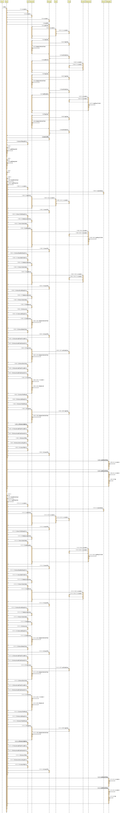

# Developer Guide

## Acknowledgements

Thanks to NUS fundamental code for Duke as well as the idea and inspiration behind this project.

## Design & Implementation

### Sequence Diagram

The **_Sequence Diagram_** given above explains the sequence when the app is started.

## Product scope
Duke is a task tracker specifically built for computing students that are comfortable with the CLI. 
Working on improving and adding features to the existing Duke project and making it useful for students to manage their schedule and work. 
Natural language will be implemented to avoid exceptions due to typing errors. 

### Target user profile
May - 23
Female

Working adult, project manager.
Having too many projects on hand, she needs to track the different project's mini task.
She would like to have a constant track of all the task she has on hand for all the projects that she is managing.
She also like to place in deadlines for all her task as well as being able to search the specific task.
This is to help her be more organised, improve her productivity and task prioritisation so that she can deliver and promote to a higher role.

As a working professional, she has a personal laptop with her all the time. 
And she prefers to use the GUI to track her task as that is what she interacts with the most throughout her day.

### User Flow
May powered up his laptop, and opened the software by double clicking on the jar file. 
She sees her todo list, by typing in "list", a list of unfinished tasks will be presented to her with the due date of each individual task. 
She started working on the task, upon finishing the tasks, she keyed in “done taskNumber” and that task is marked as done in the system. 
She keyed in “list” and saw the task he finished was marked as done.

### Value proposition

Duke is CLI + GUI software that helps individuals track the tasks that were keyed in by individual users. 
It allows users to add tasks, set due dates to a task, update tasks, and mark tasks as done. 
It also can list the tasks and let the user know how many tasks that user has finished and how many unfinished tasks, as well as the overdue tasks. 

## User Stories

| Version | As a ... | I want to ...                                              | So that I can ...                     |
| ------- | -------- | ---------------------------------------------------------- | ------------------------------------- |
| v1.0    | user     |  add a task                                                | keep track of outstanding task       |
| v1.0    | user     | delete a task if that task is no longer needed anymore     | keep my tasklist clean              |
| v1.0    | user     | see and list  all tasks                                    | have an overview of the outstanding tasks   |
| v2.0    | user     | be able to see unfinished tasks only                       | focus on the unfinished tasks |
| v2.0    | user     | mark tasks as done                                         | track the progress accordingly             |
| v2.0    | user     | be able to have different task types                       | categorize them easily                    |
| v2.0    | user     | be able to add tag label                                  | tag labels to a task              |
| v2.0    | user     | be able to search task based on keywords                   | easily extract task with important keywords |
| v3.0    | user     | be able to rank upcoming assignment in difficulty level    | choose which task to work on first    |
| v3.0    | user     | be able to see how much assignment marks                   | choose which task to work on first    |
| v3.0    | user     | be able to track assignment due date and edit when needed  | complete assignment on time           |
| v3.0    | user     | be able to mark my progress of my assignments              | decide on which assignment needs to get started |
| v3.0    | user     | be able to view task list by task type                     | focus on specific task type when the list is too long |
| v3.0    | user     | be able to view tasks with certain category tag            | focus on specific category tag when the list is too long |
| v3.0    | user     | be able to view tasks with certain date                    | focus on upcoming appointments when the list is too long |
| v3.0    | user     | be able to view tasks that contains certain keywords       | filter my task list when it is too long|

## Non-Functional Requirements

Usability - System should be able to autocorrect some of the low-level typos in user's command inputs.  

## Glossary

- _glossary item_ - Definition

## Instructions for manual testing

1. Download the jar file from Release v2.2
2. Run the application on your preferred terminal
3. To add a task, enter `todo homework 1`
4. To view your task, enter `list`
