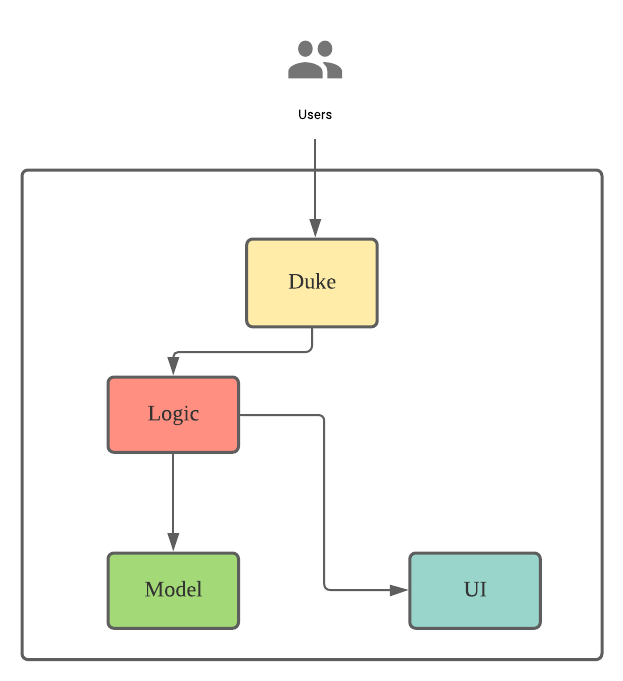
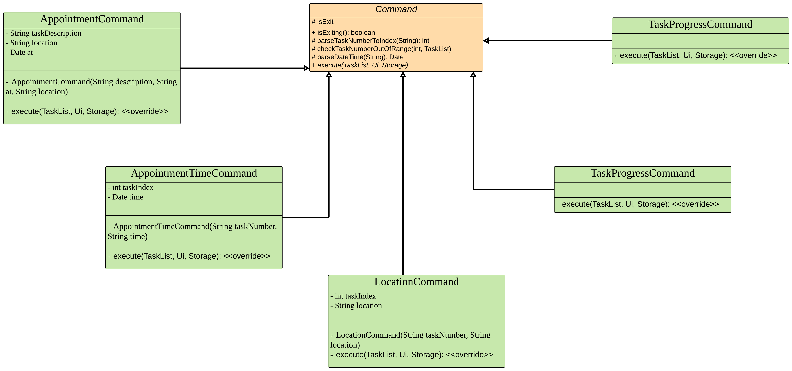

# Developer Guide

## Design

### Architecture

The *Architecture Diagram* above explains the high-level design of the app.
* `Launcher`: App entry point.
* `JavaFX` `Main`: Hold instance of `Duke`.
* `JavaFX` `MainWindow`:
  * Parent GUI of app.
  * Accept user input and trigger `Duke` logic.
* `Duke`: Main control of back-end logic.
* `Parser`: Make sense of user input.
* `Command`: Execute instruction.
* `TaskList`: Hold app data in memory.
* `Storage`: Read data from and write data to hard disk.
  

#### Interaction Between Architecture Components
The *Sequence Diagram* below shows how the components interact with each other for scenario when the user issues command `todo borrow book`.

**Note:** The lifeline for `c:Command` should end at destroy marker (X), but due to a limitation of PlantUML, the lifeline reaches the end of diagram.
  

### Command Component
Commands are implemented via an abstract `Command` class, with concrete Commands inheriting from it.

  

#### CommandResult

The `run()` function of abstract `Command` class returns a `CommandResult` data type, which contains below 2 variables.
* Feedback `String` to be displayed back to the user.
* IsExit `Boolean` to indicate if the app should exit.
  

#### CommandDataHistory
The `undo` command is implemented with help of a `CommandDataHistory` class.
* For keeping of a copy of `TaskList` before every `Command` execution.
* Appending is implemented with iteration of all existing `Task`, copying and re-creating new `Task` `Object`.  
  

## Appendix: Requirements

### User Stories
| As a           | I want to               | So that                                       |
|----------------|-------------------------|-----------------------------------------------|
| forgetful user | add task                | I can action on them later                    |
| user           | see all tasks           | I can plan my execution strategy              |
| user           | mask a task as done     | I am more productive                          |
| user           | delete a task           | I can declutter task that are no longer valid |
| user           | filter tasks by keyword | I can quickly find a task                     |
| new user       | undo previous command   | I can quickly rollback a mistake              |
 

### Non-Functional Requirements
1. Should work on Windows, Mac and Ubuntu with Java 11 installed.
1. Each command should execute within 5 seconds.
1. Should be able to hold up to 1000 tasks without noticeable degrade in performance.
