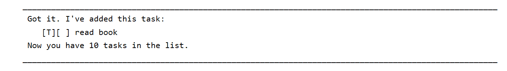
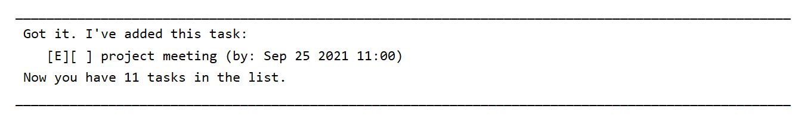
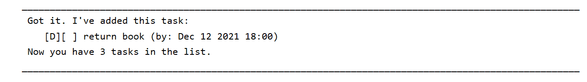
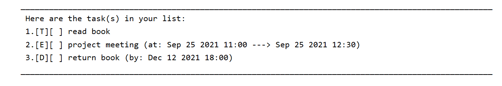
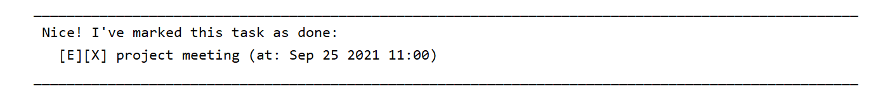
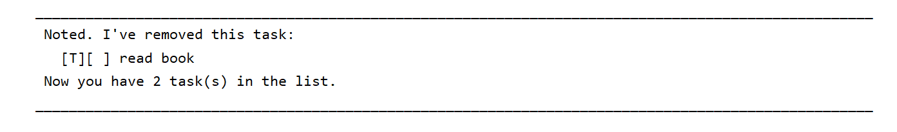
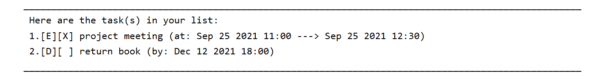

# Duke User Guide

_Table of contents_

<a href="#1">1. General Information</a>
 
&nbsp;&nbsp;&nbsp;&nbsp;&nbsp;&nbsp;&nbsp;&nbsp;<a href="#1.1">1.1 System overview</a>
 
&nbsp;&nbsp;&nbsp;&nbsp;&nbsp;&nbsp;&nbsp;&nbsp;<a href="#1.2">1.2 Organization of READ.me</a>
 

<a href="#2">2. Installation of Duke</a>

<a href="#3">3. Features</a>

<a href="#4">4. Usage</a>
 
&nbsp;&nbsp;&nbsp;&nbsp;&nbsp;&nbsp;&nbsp;&nbsp;<a href="#4.1">4.1 Commands</a>
 
&nbsp;&nbsp;&nbsp;&nbsp;&nbsp;&nbsp;&nbsp;&nbsp;<a href="#4.2">4.2 Examples</a>
 

<a href="#5">5. Error Correction Instructions</a>

<a href="#6">6. Feedback and Contact Us</a>

---
## <a id="1">1. General Information</a>
### <a id="1.1">1.1 System Overview</a>
Welcome to Duke! Duke is a simple use and useful system to help you to keep track of all your key dates for all your important task(s). These tasks can be classified into 'Todo', 'Event', 'Deadline' tasks. There are also some other features that Duke can do for you to manipulate the task you saved and for your convenience. Get start with Duke now!

### <a id="1.2">1.2 READ.me Content</a>
The user's handbook contain 6 sections: 
1. General Information
2. Installation
3. Features
4. Usage
5. Error Correction Instructions
6. Feedback and Contact Us

Section | Description
--- | ---
General Information |  An overview of what Duke system does and the purpose of the Duke 
Installation | To guide user to do installation of Duke
Features | Describe all features Duke contained
Usage | Describe all the keywords (actions) and its outcome
Error Correction Instructions | Show some possible errors user can make while using Duke
Feedback and Contact Us | Provide information to user to contact the creator of Duke

---

## <a id="2">2. Installation of Duke </a>
You can go to my GitHub [Duke](https://github.com/YangShuogeng/ip) repository page and click the button `clone` or `download` and download the zip file. Once the zip file downloaded, extract the file and locate the Duke `JAR` file. You can assess the `JAR` file to startup Duke.

---

## <a id="3">3. Features </a>
Here are the list of features of the Duke system:
1. Show all the task(s)
2. Add new task (three type task: Todo, Event, and Deadline)
    - Todo
    - Event
    - Deadline
3. Delete task
4. Find task
5. Mark task as done
6. bye

---

## <a id="4">4. Usage </a>
### <a id="4.1">4.1 Commands </a>

Here are the commands you can use to interact with Duke:

Commands | Description
--- | ---
list | Show the current entire list of task
todo [desc] | To add a Todo type task into the Duke system with description
deadline [desc] /by [deadline time] | To add a Deadline type task into the Duke system with description and deadline time
event [desc] /at [starting time] -> [ending time] | To add a Event type task into the Duke system with description, starting time, and ending time
find [keyword] | To find all task which the description contain the keyword
done [index] | To mark the specified task status as done in the task list
delete [index] | Tp delete the specified task from the task list
bye | Save the current task list to local and close Duke

Input time format: YYYY-MM-DD Hour(0-23):Minute(0-59)

### <a id="4.2">4.2 Examples </a>
Input: 
> todo read book

Expected outcome:

 Input:
 > event project meeting /at 2021-09-25 11:00 -> 2021-09-25 12:30

Expected outcome:

Input:
> deadline return book /by 2021-12-12 18:00

Expected outcome:

Input:
> list

Expected outcome:

Input:
> done 2

Expected outcome:

Input:
> delete 1

Expected outcome:

Input:
> list

Expected outcome:

Input:
> bye

Expected outcome:

---

## <a id="5">5. Error Correction Instructions</a>

Here are some errors that user may encounter when using Duke:
- DukeTaskInputException: The input task format wrong, such as missing description
- DukeDateTimeError: The input task's date/time format wrong

---

## <a id="6">6. Feedback and Contact Us</a>
Thanks for using Duke. Please feel free to drop the developer a feedback in order to improve Duke!
You can reach me by the following information:
1. +65 84300587
2. michealyang1994@gmail.com

