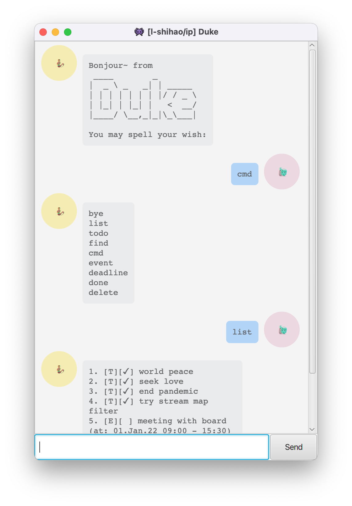

# User Guide
Duke is a desktop app for managing your daily tasks with a beautiful chatbot _graphical user interface_ (GUI) and _command line interface_ (CLI) like command input.

`Update 2022-Feb:`
## Summary of Updates:
### Tagging Support 
Tags is a useful tool to lebel your tasks for organization so later you could find them tasks in the same group in one shot. 

The tagging syntax follows the basics from [emacs org-mode way](https://orgmode.org/manual/Tags.html). Tag will be surrounded by single colon like`:work:`, multiple tags can be defined as `:work:urgent:`.

### GUI 
Now user can enjoy a beautiful chatbot chatbot like interface as the sample image below:


### Setup 

Download `ip.jar` file from the latest [release](https://github.com/l-shihao/ip/releases), 
double click to run the application (JDK 11 is required).

----
## Features

### Task Types
There are 3 types of task that Duke recognizes – Todo, Event and Deadline:
+ Todo is a simple task with title only;
+ Event is a task with a date and a time range (e.g. `/at 2022-01-04 1700-1925`);
+ Deadline is a task with due date and time (e.g. `/by 2022-01-20 945`).

### Operations
Besides creation of the above mentioned tasks, Duke provides basic functionalities to manipulate the tasks, such as:
+ list all the tasks
+ list all the command keywords
+ mark one or multiple tasks done at once
+ delete one or multiple tasks done at once
+ find tasks that contains certain keywords

`Update 2022-Feb:`
+ [add tasks with tags](UserGuide.md#todo---Add-Todo)
+ [tag existing task](UserGuide.md#tag---Append-tags-to-a-task)
+ [find tasks with certain tag](UserGuide.md#Only-filter-by-a-tag)

### Storage
The program will create a `./data` folder (under same directory where user stores the `jar` file), under which a text file called `duke.txt` will store the tasks in plain text. So when the program starts next time, all the record can be read and retrived.

## Usage

### `cmd` List all command keywords

Format: `cmd`

Expected outcome:

```
 bye
 list
 todo
 find
 cmd
 tag
 event
 deadline
 done
 delete
```
### `list` - List all tasks

Format: `list`

Example outcome:
```
 1.[T][x] world peace
 2.[T][ ] seek love
 3.[T][x] end pandemic :covid:vaccine:
 4.[T][x] try stream map filter
 5.[E][ ] meeting with board (at: 01.Jan.22 09:00 - 15:30)
 6.[D][x] submit homework (by: 27.Sep.21 23:59)
```
### `done` - Mark selected tasks done

Format: `done INDEX1 INDEX2 ... INDEXN`
- `INDEX` are the number in front of tasks shown by `list` command

Example: `done 1 2`

Expected outcome:
```
 Marked below as DONE:
 [T][x] world peace
 Task completion status: 4 / 7
 Marked below as DONE:
 [T][x] seek love
 Task completion status: 5 / 7
```

### `delete` - Delete selected tasks

Format: `delete INDEX1 INDEX2 ... INDEXN`
- `INDEX` are the number in front of tasks shown by `list` command

Example: `delete 8 9`

Expected outcome:
```
 Roger. Below get removed: 
 [T][ ] 1
 [T][ ] 2
 Task completion status: 5 / 7
```

`Update 2022-Feb:`
### `todo` - Add Todo

Format: `todo TITLE :TAG1:TAG2:...:`

Example: `todo buy milk :personal:shopping:15min:`

Expected outcome:
```
 added: [T][ ] buy milk :personal:shopping:15min
 Task completion status: 5 / 8
```

`Update 2022-Feb:`
### `event` - Add Event at date time range

Format: `event TITLE :TAG1:TAG2:...: /at DATE TIME-TIME`
- recommended date time range format: `yyyy-MM-dd HHmm-HHmm`

Example: `event meeting with board :work: /at 2022-01-01 0900-1530`

Expected outcome:
```
 added: [E][ ] meeting with board :work: (at: 01.Jan.22 09:00 - 15:30)
 Task completion status: 5 / 8
```

`Update 2022-Feb:`
### `deadline` - Add Deadline by date time

Format: `deadline TITLE :TAG1:TAG2:...: /by DATE TIME`
- recommended date time range format: `yyyy-MM-dd HHmm`

Example: `deadline submit homework /by 2021-09-27 2359`

Expected outcome:
```
 added: [E][ ] submit homework (by: 27.Sep.21 23:59)
 Task completion status: 5 / 8
```

`Update 2022-Feb:`
### `tag` - Append tags to a task 
Format: `tag INDEX TAG1 TAG2 ...`

Example: `tag 3 Covid vaccine`

Expected outcome:
```
 Tags after append:
 [T][x] end pandemic :covid:vaccine:
```


`Update 2022-Feb:`
### `find` - Find tasks containing keywords

#### Search the occurrences of keywords from title and tags

Format: `find KEYWORDS`

Example: `find world`

Expected outcome:
```
 1.[E][ ] test: event with tags :add:world:test: (at: 19.Feb.22 10:00 - 11:30)
 2.[T][x] world peace
 3.[T][ ] world war II
 4.[T][ ] buy sci-fi world magazine :10min:
```

#### Only filter by a tag

Format: `find :TAG:`

Example: `find :world:`

Expected outcome:
```
 1.[E][ ] test: event with tags :add:world:test: (at: 19.Feb.22 10:00 - 11:30)
```
